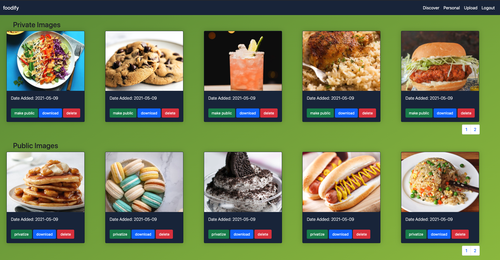
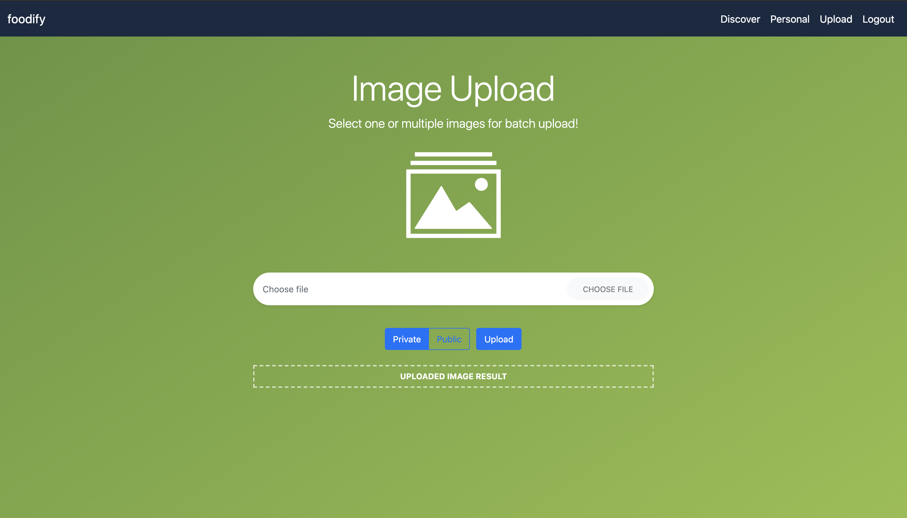

<br />
<p align="center">
  <a href="https://github.com/AndyKChen/shopify_challenge">
    
  </a>

  <h3 align="center">foodify</h3>

  <p align="center">
    Image Sharing and Repository App for Shopify F2021 Developer Intern Challenge
    <br />
  </p>
</p>


<!-- TABLE OF CONTENTS -->
<details open="open">
  <summary><h2 style="display: inline-block">Table of Contents</h2></summary>
  <ol>
    <li>
      <a href="#about-the-project">About The Project</a>
      <ul>
        <li><a href="#built-with">Built With</a></li>
        <li><a href="#what-im-proud-of">What I'm Proud Of</a></li>
      </ul>
    </li>
    <li>
      <a href="#getting-started">Getting Started</a>
      <ul>
        <li><a href="#usage">Usage</a></li>
        <li><a href="#installation">Installation</a></li>
      </ul>
    </li>
    <li><a href="#contact">Contact</a></li>
  </ol>
</details>


<!-- ABOUT THE PROJECT -->
## About The Project




### Built With

* Flask and Python
* AWS S3 and Cloudfront
* PostgreSQL
* HTML/CSS/JS/JINJA

### What I'm Proud Of

* **Fast Bulk Image Upload:** With Python's multiprocessing module, I was able to leverage a thread pool to achieve concurrent uploads. This decreased upload time **3-fold** for bulk image uploads!
* **Fast and Secure Content Delivery Network:** Takes advantage of caching content in edge locations to serve images almost immedietly. This allows for low latency and fast download speeds anywhere in the world.
* **Presigned URLs**: Images are downloaded and uploaded using presigned URLs which reduces load on application server, hides AWS credentials from the client, and enables URL expiry.
* **Private/Public Access:** Public images are available to download for all users on the "Discover" page, while private images are available on the "Personal" page. Users can also modify access or delete images after upload.
* **Security:** User accounts are saved in PostgreSQL and users authenticated with secure sessions. All image keys are also converted to a uuid before stored in the S3 bucket.
* **Testing:** The application includes a comprehensive testing suite with unit tests for every feature from user login to image upload.
* **Design Considerations:** There is an organized and modular file structure that separates models, views, and controllers so adding new features is easy. Use of AWS S3 and Cloudfront also help make the application easily scalable. Lastly, I used a simple UI and pagination for better user experience.



<!-- GETTING STARTED -->
## Getting Started

### Usage

The application is separated into a few simple pages:
* **Login/Register**: Before accessing personal repository and upload functionality, the user must create an account and login. Usernames must be unique and passwords must be of at least length 8 with a capital letter and symbol.
* **Discovery**: Displays all public images from all users. User login is not neccessary to view this page and download images.
* **Upload:** Upload a (reasonably) unlimited number of images at once and choose public/private access.
* **Personal:** Displays all images categorized between private and public of a logged in user. For each image, the user can delete it or change its access level.


### Installation

1. Clone the repo
   ```sh
   git clone https://github.com/AndyKChen/shopify_challenge.git
   ```
2. Create virtual environment
   ```sh
   python -m venv venv
   ```
3. Activate virtual environment
   ```sh
   source venv/bin/activate # for MacOS
   source venv/Scripts/activate # for Windows
   ```
4. Install requirements
   ```sh
   pip install requirements.txt
   ```
5. Export environment variables
   ```sh
   export FLASK_APP=shopify_challenge
   ```
6. Run App (from root directory)
   ```sh
   flask run
   ```
7. Testing (from root directory)
   ```sh
   pytest
   ```
***Note you must create a .env file in root directory with the following***:
  ```sh
   SECRET='your flask app secret'
   ACCESS_KEY_ID='your aws access key id'
   SECRET_ACCESS_KEY='your aws secret access key'
   S3_BUCKET_NAME='your aws s3 bucket name'
   CLOUDFRONT_DOMAIN='your cloudfront domain'
   ```

<!-- Contact -->
## Contact
Andy Chen - [@Linkedin](https://www.linkedin.com/in/andyc12/) - andy.chen1@uwaterloo.ca

Project Link: [https://github.com/AndyKChen/shopify_challenge](https://github.com/github_username/repo_name)
